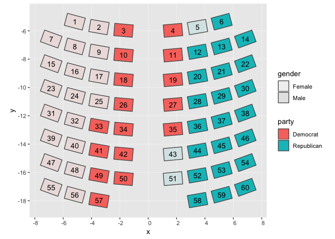

``` r
library(here)
```

    ## here() starts at /Users/wickhamc/Documents/Projects/or-house-vis/party

``` r
library(tidyverse)
```

    ## ── Attaching packages ────────────────────────────────────────────────────────────── tidyverse 1.2.1 ──

    ## ✔ ggplot2 3.1.0     ✔ purrr   0.2.5
    ## ✔ tibble  2.0.1     ✔ dplyr   0.7.8
    ## ✔ tidyr   0.8.2     ✔ stringr 1.3.1
    ## ✔ readr   1.1.1     ✔ forcats 0.3.0

    ## Warning: package 'tibble' was built under R version 3.5.2

    ## ── Conflicts ───────────────────────────────────────────────────────────────── tidyverse_conflicts() ──
    ## ✖ dplyr::filter() masks stats::filter()
    ## ✖ dplyr::lag()    masks stats::lag()

``` r
library(glue)
```

    ## 
    ## Attaching package: 'glue'

    ## The following object is masked from 'package:dplyr':
    ## 
    ##     collapse

``` r
library(sf)
```

    ## Linking to GEOS 3.6.1, GDAL 2.1.3, PROJ 4.9.3

``` r
# devtools::install_github("or-house-vis/history")
library(history) 
```

Seats held by two major parties
===============================

Calculate seats over majority
-----------------------------

Summarize seats held by each party each regular session:

``` r
party_seats_held <- house_reps_regular %>% 
  group_by(session_year, party) %>% 
  count() %>% 
  ungroup() %>% 
  complete(session_year, party, fill = list(n = 0))
  # filled out so there is a row for every party in every year

party_seats_sum <- party_seats_held %>% 
  group_by(session_year) %>% 
  mutate(
    # put in explicit missings for the years with no records
    n = if_else(session_year %in% 1887:1891, NA_real_, n),
    filled_seats = sum(n),
    prop = n/filled_seats
  )

# check for record gap
party_seats_sum %>% 
  ggplot(aes(session_year, n)) +
    geom_line(aes(color = party)) +
    facet_wrap(~ party) +
    scale_color_manual(values = party_colors)
```

    ## Warning: Removed 83 rows containing missing values (geom_path).


How many seats over majority?

``` r
party_seats_over <- party_seats_sum %>% 
  mutate(
    required_thresh = floor(filled_seats/2),
    seats_over = if_else(n > required_thresh, n - required_thresh, 0)
  ) 
```

Just Republicans and Democrats

``` r
dr_seats_over <- party_seats_over %>% 
  filter(party %in% c("Republican", "Democrat"))
```

Flip democrats to be negative to put them on LHS of zero

``` r
dr_seats_over <- dr_seats_over %>% 
  mutate(
    side = if_else(party == "Democrat", -1, 1),
    seats_over_side = seats_over * side
  )
```

Static version of interactive timeline

``` r
dr_seats_over %>% 
  ggplot(aes(-session_year, seats_over_side)) + 
    geom_line(aes(color = party)) + 
    geom_area(aes(fill = party), alpha = 0.5, position = "identity") +
    coord_flip(clip = "off") +
    scale_x_continuous(expand = c(0, 0),
      breaks = c(-1860, seq(-1875, -2018, by = -25), -2018),
      labels = -1*c(-1860, seq(-1875, -2018, by = -25), -2018)) +
    scale_y_continuous("", limits = c(-30, 40),
      breaks = c(-30, -15, 0, 15, 30),
      labels = c(30, 15, 0, 15, 30), position = "right",
      sec.axis = dup_axis())  +
    scale_fill_manual(values = party_colors) +
    scale_color_manual(values = party_colors)
```


Add captions
------------

Caption for a session year, describing which of the two major parties has a majority and by how many seats:

``` r
year_captions <- dr_seats_over %>% 
  arrange(session_year) %>% 
  group_by(session_year) %>% 
  filter(abs(seats_over_side) > 0) %>% 
  mutate(
    seats = abs(seats_over_side),
    color = party_colors[party],
    caption = glue('
      <strong>{session_year}</strong> <span style = "color:{color}">{party}s</span> have  {seats} seats over a majority.')
  ) %>% 
  select(session_year, caption) 
  
weird_year_captions <- tribble(
    ~ session_year, ~ caption,
    1874, "Neither party has a majority.",
    1887, "Party affiliations unknown.",
    1889, "Party affiliations unknown.",
    1891, "Party affiliations unknown.",
    2011, "Equally split between parties.",
    2012, "Equally split between parties.") %>% 
  mutate(caption = glue("<strong>{session_year}</strong> {caption}"))

year_captions <- bind_rows(year_captions, weird_year_captions)
```

Tabulations for all parties for each session year:

``` r
# only need rows for parties represented in the session_year, 
# with parties listed from highest seats to lowest seats
party_seats_tab <- party_seats_sum %>% 
  filter(n != 0) %>% 
  arrange(session_year, desc(n)) %>% 
  select(session_year, party, n)

party_tables <- party_seats_tab %>% 
  nest() %>% 
  mutate(
    table = map(data, knitr::kable, 
      format = "html",
      row.names = FALSE,
      col.names = c("Party", "Seats")),
    table_str = as.character(table)
  ) %>% 
  select(session_year, table_str)
```

Put all together, will have captions duplicated for both Democrat and Republican rows:

``` r
dr_seats_over_captioned <- dr_seats_over %>% 
  left_join(year_captions) %>% 
  left_join(party_tables) %>% 
  select(session_year, party, seats_over_side, caption, table_str) 
```

    ## Joining, by = "session_year"
    ## Joining, by = "session_year"

To Do:

\[ \] add way to test this with vega-lite that doesn't clobber published spec.

Seats
=====

Get geojson from <https://github.com/or-house-vis/seat-layout>

``` r
url <- "https://raw.githubusercontent.com/or-house-vis/seat-layout/master/seats.json"
local <- here("docs", "data", "seats.json")
not_ok <- download.file(url, local)
stopifnot(!not_ok)

seats <- sf::read_sf(local)
seats %>% 
  select(col, row, seat)
```

    ## Simple feature collection with 60 features and 3 fields
    ## geometry type:  POLYGON
    ## dimension:      XY
    ## bbox:           xmin: -7.604422 ymin: -18.49456 xmax: 7.604422 ymax: -4.769639
    ## epsg (SRID):    4326
    ## proj4string:    +proj=longlat +datum=WGS84 +no_defs
    ## # A tibble: 60 x 4
    ##      col   row  seat                                               geometry
    ##    <int> <int> <int>                                          <POLYGON [°]>
    ##  1     2     1     1 ((-4.65728 -5.950986, -5.921273 -5.612301, -5.695482 …
    ##  2     3     1     2 ((-2.904357 -6.281135, -4.193059 -6.053902, -4.04157 …
    ##  3     4     1     3 ((-1.129331 -6.457249, -2.432933 -6.343199, -2.356899…
    ##  4     5     1     4 ((1.129331 -6.457249, 1.053297 -5.588181, 2.356899 -5…
    ##  5     6     1     5 ((2.904357 -6.281135, 2.752869 -5.422, 4.04157 -5.194…
    ##  6     7     1     6 ((4.65728 -5.950986, 4.431489 -5.108325, 5.695482 -4.…
    ##  7     1     2     7 ((-6.374758 -7.214093, -7.604422 -6.766532, -7.306048…
    ##  8     2     2     8 ((-4.65728 -7.695762, -5.921273 -7.357076, -5.695482 …
    ##  9     3     2     9 ((-2.904357 -8.02591, -4.193059 -7.798677, -4.04157 -…
    ## 10     4     2    10 ((-1.129331 -8.202025, -2.432933 -8.087974, -2.356899…
    ## # … with 50 more rows

``` r
# function to find seat number where
# seats are filled top to bottom, from outside in
find_seats <- function(ids, seats_df){
  seats_df %>% 
    arrange(row, abs(col - 4.5)) %>% 
    slice(seq_len(length(ids))) %>% 
    arrange(col, row) %>% 
    pull(seat)
}
```

Individual Legislator data
==========================

Get and assign to seats based on party and gender
-------------------------------------------------

``` r
legislators <- house_reps_regular %>% 
  mutate(
    party = party %>% 
      as_factor() %>% 
      fct_explicit_na() %>% 
      fct_relevel("(Missing)", after = 2)
    ) %>% 
  select(session_year, legislator, party, gender, residence, profession,
    notes) %>% 
  group_by(session_year) %>% 
  arrange(session_year, party, gender) %>% 
  mutate(id = 1:n(),
    seat = find_seats(id, seats))
```

Check on ordering:

``` r
legislators %>% 
  filter(session_year == 2018) %>% 
  left_join(seats) %>% 
  ggplot() + 
    geom_sf(aes(fill =  party, alpha = gender)) +
    geom_sf_text(aes(label = seat))
```

    ## Joining, by = "seat"

    ## Warning: Using alpha for a discrete variable is not advised.

    ## Warning in st_point_on_surface.sfc(sf::st_zm(x)): st_point_on_surface may
    ## not give correct results for longitude/latitude data



Legislator Captions
-------------------

Clean up names and long strings in notes and residence:

``` r
legislators_nice <- legislators %>% 
  mutate(name_split = str_split(legislator, ",", n = 2),
    # clean up names
    bad_name = map_lgl(name_split, ~ length(.) < 2),
    last_name = map_chr(name_split, 1) %>% str_trim(),
    first_name = ifelse(bad_name,
      list(c("")),
      map(name_split, 2)) %>% flatten_chr() %>% str_trim(),
    nice_name = str_c(first_name, last_name, sep = " "),
    # clean and wrap notes and residence
    notes = str_replace(notes, "\n", " ") %>% 
      str_wrap(width = 40) %>% 
      str_replace_all("\n", "<br/>"),
    residence = residence %>% 
      str_wrap(width = 40) %>% 
      str_replace_all("\n", "<br/>"))
```

Compose caption:

``` r
legislators_captions <- legislators_nice  %>% 
  mutate(
    caption = glue('
      <strong>{nice_name}</strong><br/>
      {party}<br/>
      {gender}<br/>
      Representing {residence}
    '
    ),
    caption = ifelse(is.na(notes), caption, 
      str_c(caption, "<br/><br/><em>", notes, "</em>"))
) %>% 
  select(session_year, legislator, caption) 
```

Putting it all together
-----------------------

``` r
people <- legislators %>% 
  left_join(legislators_captions) %>% 
  select(session_year, legislator, party, id, seat, caption) %>% 
  mutate(data = "legislators") 
```

    ## Joining, by = c("session_year", "legislator")

``` r
years <- dr_seats_over_captioned %>% 
  mutate(data = "majority")

all <- years %>% 
  ungroup() %>% 
  bind_rows(people) %>% 
  mutate(session_year = ISOdate(year = session_year, month = 1, day = 1,
    tz = "utc")) 
```

    ## Warning in bind_rows_(x, .id): binding character and factor vector,
    ## coercing into character vector

Examine changes

``` r
old <- read_csv(here("docs", "data", "vega-all.csv"))
diffs <- diff_data(all, old, ordered = FALSE)
render_diff(diffs)
```

Overwrite old data

``` r
all %>%
  write_csv(here("docs", "data", "vega-all.csv"))
```
